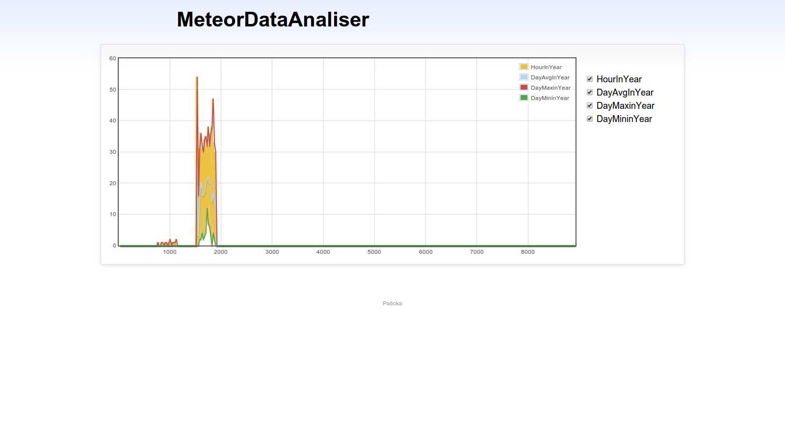

MeteorDataAnalyser
==================

Software for generating graphs from radio meteors observations with web output

HProcessor
===================

You can check it out on [nbviewer](http://nbviewer.ipython.org/github/bolidozor/MeteorDataAnalyser/blob/master/iHProcessor.ipynb)

Simple ipython notebook that views histograms for frequency data loaded from csv tables

Dependencies:
-------------
 * python2.7
 * ipython-notebook
 * pandas
 * 
 
DHProcessor
===================

[nbviewer](http://nbviewer.ipython.org/github/bolidozor/MeteorDataAnalyser/blob/dev/iDHProcessor.ipynb)

Updated version of HProcessor. Views histograms for multiple stations as well as included observation times.

Dependencies:
------------- 
 * python2.7
 * ipython-notebook
 * pandas
